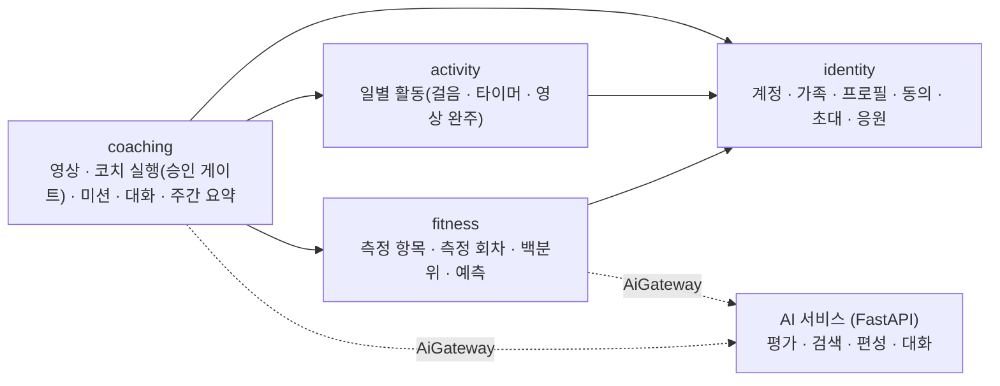

# 아키텍처

Spring Boot 하나의 모듈러 모놀리스(Spring Modulith). 모듈 = 패키지 = ERD 묶음이며, 각 모듈은
`domain` · `application` · `adapter` 세 계층으로 나뉜다.

## 모듈과 의존

- 모듈 밖에서 참조할 수 있는 것은 각 모듈의 `api` 패키지(`@NamedInterface`)뿐이다. `identity::api` 는
  `ProfileSummary` · `ProfileDetails` · `ProfileQuery` · `FamilyAccess` · `CheerQuery`, `fitness::api` 는 `FitnessQuery`,
  `activity::api` 는 `ActivityRecorder` · `ActivityQuery` 다. 다른 모듈의 JPA 엔티티·리포지터리는 참조하지 않는다.
- coaching 이 fitness·activity 를 참조하는 이유: 미션 완료 판정이 활동(타이머·걸음수)과 측정(편성 assess 단계)에 걸친다.
  이 의존은 `package-info.java` 의 `allowedDependencies` 와 `ModularityTests` 가 강제한다.
- `shared` 는 모듈이 아니다(`spring.modulith.detection-strategy=explicitly-annotated`). 오류 형식, JWT 보안,
  공용 타입(연령대·성별·체력 요인·역할), AI 게이트웨이 계약이 여기 있다.

## 계층

| 계층 | 아는 것 | 모르는 것 |
|---|---|---|
| `domain` | 규칙 · 상태 전이 · 값 객체 | Spring · JPA · HTTP |
| `application` | 유스케이스 · 트랜잭션 · 포트(인터페이스) | HTTP · SQL |
| `adapter.in.web` | 컨트롤러 · 요청/응답 DTO · 인증 사용자 | 규칙 |
| `adapter.out.persistence` | JPA 엔티티 · 리포지터리 · 도메인 ↔ 엔티티 변환 | 규칙 |

승인 게이트(`CoachRun`)와 가족(`Family`)처럼 규칙이 있는 애그리게잇은 도메인 모델과 JPA 엔티티를 따로 둔다.
응원(`Cheer`)처럼 규칙이 거의 없는 것은 엔티티를 그대로 쓴다.

## 호출 규칙

- actor(로그인 계정 `userId`)는 JWT `sub` 에서 얻는다. 요청 본문의 role·familyId 를 믿지 않는다.
- `profileId` 는 기록의 대상이고 actor 와 다를 수 있다. 부모가 아이 기록을 대리 입력한다.
- 가족 권한은 `FamilyAccess` 가 저장소에서 판단한다. 다른 가족은 403 `NOT_SAME_FAMILY`, 자녀 계정의 보호자 기능은 403 `NOT_A_PARENT`.
- 실패 응답은 한 형태 `{"error": {"code", "message"}}`. 도메인 예외는 `DomainException(code, ErrorKind)` 이고
  `ErrorKind` → HTTP 상태 매핑은 `ApiErrorHandler` 한 곳에만 있다.
- 시간은 `Clock` 빈으로만 읽는다. 활동 날짜는 `Asia/Seoul` 기준.

## AI 서비스 경계

- AI 서비스는 서비스 테이블에 쓰지 않는다. 계산해서 JSON 을 돌려줄 뿐이고, 저장·승인·미션 생성은 전부 이 서버가 한다.
- 호출 계약은 `shared.ai.AiGateway` 하나다. `app.ai.mode=http` 면 `{base-url}/v1` 의 FastAPI 를 부르고,
  `stub` 이면 AI 서비스 없이 결정적 가짜 응답을 낸다(local 기본). 실제 AI 서비스는 아직 `/healthz`·`/readyz` 만 있다.
- AI 가 돌려준 제안은 보호자가 승인하기 전에는 미션이 아니다. `CoachRun` 이 `AWAITING_APPROVAL` 에서 멈추고,
  미션 INSERT 는 승인 트랜잭션 안 한 경로에서만 일어난다.

## 데이터베이스

- Flyway 마이그레이션(`backend/src/main/resources/db/migration`)이 정본이다. PostgreSQL 과 H2(PostgreSQL 모드)
  양쪽에서 같은 SQL 이 돌도록 DB 전용 문법을 쓰지 않는다. ID·시각은 애플리케이션이 채운다.
- 로컬은 H2 인메모리 + 샘플 시드(`db/seed`, 임의값)로 외부 의존성 없이 뜬다. 실제 국민체력100 규준 적재는 후속 작업이다.
