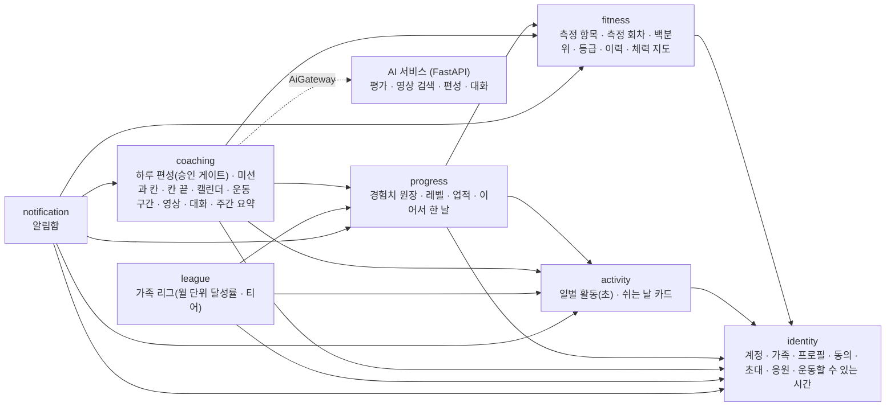

# 아키텍처

Spring Boot 하나의 모듈러 모놀리스(Spring Modulith). 업무 모듈은 일곱 개다. 모듈 = 패키지 = ERD 묶음이며, 각 모듈은
`domain` · `application` · `adapter` 세 계층으로 나뉜다. 기준은 develop `a880ad4`(2026-09-29)다.

## 모듈과 의존

```mermaid
flowchart LR
    identity["identity\n계정 · 가족 · 프로필 · 동의 · 초대 · 응원 · 운동할 수 있는 시간"]
    fitness["fitness\n측정 항목 · 측정 회차 · 백분위 · 등급 · 이력 · 체력 지도"]
    activity["activity\n일별 활동(초) · 쉬는 날 카드"]
    progress["progress\n경험치 원장 · 레벨 · 업적 · 이어서 한 날"]
    coaching["coaching\n하루 편성(승인 게이트) · 미션과 칸 · 칸 끝 · 캘린더 · 운동 구간 · 영상 · 대화 · 주간 요약"]
    league["league\n가족 리그(월 단위 달성률 · 티어)"]
    notification["notification\n알림함"]
    ai["AI 서비스 (FastAPI)\n평가 · 영상 검색 · 편성 · 대화"]
    fitness --> identity
    activity --> identity
    progress --> identity
    progress --> activity
    progress --> fitness
    coaching --> identity
    coaching --> fitness
    coaching --> activity
    coaching --> progress
    league --> identity
    league --> activity
    league --> progress
    notification --> identity
    notification --> fitness
    notification --> activity
    notification --> progress
    notification --> coaching
    coaching -. AiGateway .-> ai
```

화살표는 「이 모듈이 저 모듈의 `api` 패키지를 부른다」 는 뜻이다.

| 모듈 | 부르는 모듈(`api` 만) | 밖으로 여는 `api` |
|---|---|---|
| `identity` | 없음 | `ProfileSummary` · `ProfileDetails` · `ProfileQuery` · `FamilyAccess` · `CheerQuery` · `CheerView` · `CheerKind` · `CheerSent` · `AvailabilityQuery` · `AvailabilitySlot` · `InviteStatus` · `MissionLookup`(SPI) 와 예외들 |
| `fitness` | identity | `FitnessQuery` · `LatestFitness` · `FactorPoint` · `FitnessTestRegistered` |
| `activity` | identity | `ActivityRecorder` · `ActivityQuery` · `RestDayQuery` · `ActivitySource` 와 조회 값 |
| `progress` | identity · activity · fitness | `ProgressRecorder` · `SessionDone` · `AchievementEarned` · `PlannedDays`(SPI) · `PlannedDaysSinceCreated`(SPI) |
| `coaching` | identity · fitness · activity · progress | `SessionCompleted` · `MissionCompleted` · `MissionCreated` · `MissionCancelled` · `StandingMissionQuery` · `StandingMission` |
| `league` | identity · activity · progress | 없음 |
| `notification` | identity · fitness · activity · progress · coaching | 없음 |

- 모듈 밖에서 참조할 수 있는 것은 각 모듈의 `api` 패키지(`@NamedInterface("api")`)뿐이다. 다른 모듈의 JPA 엔티티 · 리포지터리 ·
  `application` · `domain` 은 참조하지 않는다.
- 순환은 없다. 아래쪽 모듈이 위쪽 모듈의 데이터를 물어야 할 때는 인터페이스(SPI)를 아래쪽 `api` 에 두고 위쪽이 구현한다(의존 역전).

| SPI | 둔 곳 | 구현 | 쓰는 곳 · 까닭 |
|---|---|---|---|
| `MissionLookup` | `identity.api` | coaching `MissionLookupService` | 응원의 `missionId` 가 이 가족 미션인지 identity 가 묻는다 |
| `PlannedDays` | `progress.api` | coaching `PlannedDaysService` | 이어서 한 날(streakDays)이 「운동이 잡힌 날」 을 묻는다 |
| `PlannedDaysSinceCreated` | `progress.api` | coaching `PlannedDaysService` | 리그 달성률의 분모. 미션을 만든 날 이후의 잡힌 날만 |
| `StandingMissionQuery` | `coaching.api` | coaching `StandingMissionService` | 알림(`MISSION_READY`)이 오늘 서는 미션을 묻는다 |

- **notification 은 아무도 부르지 않는다.** 다른 모듈의 일은 이벤트로만 닿는다(아래 「도메인 이벤트」). league 도 다른 모듈이 부르지 않는다.
- 칸 끝 경험치는 이벤트가 아니다. coaching 이 `progress.api.ProgressRecorder` 를 직접(동기) 불러 적립한 값(`xpGained`)을 응답에 싣는다.
- 이 의존은 각 모듈 `package-info.java` 의 `allowedDependencies` 와 `ModularityTests` 가 강제한다. `ModularityTests` 는
  Modulith 검증(순환 · 내부 패키지 접근 · 선언된 의존)과 ArchUnit 허용 표(모듈마다 부를 수 있는 모듈 목록 — 위 표와 같다)를 같이 돌린다.
- `shared` 는 모듈이 아니다(`spring.modulith.detection-strategy=explicitly-annotated`). 오류 형식, JWT 보안,
  공용 타입(연령대 · 성별 · 체력 요인 · 역할), AI 게이트웨이 계약이 여기 있다.

## 도메인 이벤트

이벤트는 발행한 쪽의 트랜잭션 안에서 낸다. 이벤트 발행 기록 저장소(spring-modulith event publication registry)는 쓰지 않는다.
그래서 커밋 뒤에 받는 쪽이 실패하면 다시 보내지 않는다. 받는 쪽은 이것을 보고 두 가지로 나눴다.

- **경험치(progress)는 같은 트랜잭션에서 동기로 듣는다**(`@EventListener`). 원장은 줄지 않는 값이라 빠진 적립을 되살릴 길이 없다.
  같은 트랜잭션이면 적립과 원래 일(응원 · 측정)이 함께 저장되거나 함께 되돌려진다. FE 가 곧바로 다시 읽는 레벨에도 이미 반영돼 있다.
  원장 · 업적 넣기는 `ON CONFLICT DO NOTHING` 이다. 두 요청이 같은 적립을 동시에 넣어도 늦은 쪽은 건너뛸 뿐, 원래 요청이 되돌려지지 않는다.
- **알림(notification)은 커밋 뒤에 듣는다**(`@TransactionalEventListener(AFTER_COMMIT, fallbackExecution = true)`). 알림이 실패해도
  원래 일은 되돌아가지 않는다. 실패는 로그만 남긴다.
  - 리스너는 일을 알림 전용 스레드 풀(`notificationTaskExecutor`, 스레드 2 · 대기열 1000)에 넘기기만 한다. 쓰기는 그 스레드가
    `NotificationWriter`(메서드마다 `REQUIRES_NEW`)로 한다.
  - 요청 스레드에서 쓰지 않는 까닭: 커밋 뒤 콜백은 원래 트랜잭션의 커넥션을 아직 쥐고 있다. 거기서 새 트랜잭션을 열면 요청 하나가
    커넥션 두 개를 쥐고, 동시 요청이 커넥션 풀을 넘으면 서로 기다리다 멈춘다. 알림 스레드는 커넥션을 스레드 수(2)만큼만 더 쓴다.
  - 그래서 알림은 응답보다 조금 늦게 생긴다. 대기열까지 차면 그 알림은 버리고 로그를 남긴다. 서버를 내릴 때는 대기열을 최대 10초 비우고 내린다.
  - 넣기는 `ON CONFLICT DO NOTHING`(JDBC)이라 같은 알림이 동시에 와도 한 건만 남는다.
  - 설정: `app.notification.executor.pool-size`(2) · `app.notification.executor.queue-capacity`(1000). 시험 프로필은
    `app.notification.executor.async=false` 로 부른 스레드에서 곧바로 쓴다.

| 이벤트 | 내는 곳 · 언제 | 듣는 곳 · 무엇을 | 받는 때 |
|---|---|---|---|
| `identity.api.CheerSent` | `CheerService.cheer` — 응원을 저장한 뒤 | progress: 스티커 붙은 `PRAISE` 면 `STICKER` +10(같은 미션에 한 번) · 업적 판정 | 같은 트랜잭션, 동기 |
| | | notification: `KID_DONE` · `KID_THANKS` · `PRAISE` | 커밋 뒤 |
| `fitness.api.FitnessTestRegistered` | `FitnessTestService.register` — 측정 회차를 저장한 뒤 | progress: 다시 잰 회차가 생기면 `REMEASURE` +20 · 업적 판정 | 같은 트랜잭션, 동기 |
| | | notification: 그 아이의 지난 측정 회차로 만든 `REMEASURE` 를 부모 알림함에서 지운다 | 커밋 뒤 |
| `coaching.api.SessionCompleted` | `SessionCompletionService` — 칸 끝을 새로 적은 사람마다(번진 보호자 포함) | 지금 듣는 곳이 없다 | — |
| `coaching.api.MissionCompleted` | `SessionCompletionService` — 칸 끝으로 참여자가 막 완료됐을 때 한 번 | notification: 그 사람의 그 미션 `MISSION_READY` 를 뺀다 | 커밋 뒤 |
| `coaching.api.MissionCreated` | `MissionService.createAll`(직접 만들기 · 여러 날) · `CoachRunService.approve`(제안 승인) — 미션마다 | notification: 오늘이 기간 안이고 07:30(KST)이 지났으면 곧바로 `MISSION_READY` | 커밋 뒤 |
| `coaching.api.MissionCancelled` | `MissionDeletionService.delete` — 미션을 지운 뒤 | notification: 그 미션의 알림을 지운다 | 커밋 뒤 |
| `progress.api.AchievementEarned` | `AchievementAwards` — 업적을 처음 저장할 때(칸 끝 · 응원 · 측정 트랜잭션 안) | notification: 아이 프로필이면 `ACHIEVEMENT` | 원래 요청의 커밋 뒤 |
| `CoachRunRequested`(coaching 내부) | `CoachRunService.start` — RUNNING 을 저장한 뒤 | coaching `CoachRunExecutor`: 편성 전용 스레드 풀에 넘긴다 | 커밋 뒤 |

- 옛 경로(타이머 · 걸음수 · 영상 진행 · 보호자 확인)로 끝난 미션은 `MissionCompleted` 를 내지 않는다.
- `REMEASURE` 알림은 이벤트가 아니라 09:00 스케줄러가 `fitness.api` 의 마지막 측정일을 읽어 만든다. 지우는 것은 `FitnessTestRegistered` 를 듣고 한다.
- 표의 「커밋 뒤」 는 모두 알림 전용 스레드에서 쓴다는 뜻이다. `CoachRunRequested` 만 편성 전용 스레드 풀이다.

## 계층

| 계층 | 아는 것 | 모르는 것 |
|---|---|---|
| `domain` | 규칙 · 상태 전이 · 값 객체 | Spring · JPA · HTTP |
| `application` | 유스케이스 · 트랜잭션 · 포트(인터페이스) | HTTP · SQL |
| `adapter.inbound.web` | 컨트롤러 · 요청/응답 DTO · 인증 사용자 | 규칙 |
| `adapter.outbound.persistence` | JPA 엔티티 · 리포지터리 · 도메인 ↔ 엔티티 변환 | 규칙 |

승인 게이트(`CoachRun`) · 가족(`Family`) · 미션(`Mission`)처럼 규칙이 있는 애그리게잇은 도메인 모델과 JPA 엔티티를 따로 둔다.
응원(`Cheer`)처럼 규칙이 적은 것은 엔티티를 그대로 쓴다.

## 호출 규칙

- actor(로그인 계정 `userId`)는 JWT `sub` 에서 얻는다. 요청 본문의 role · familyId 를 믿지 않는다.
- `profileId` 는 기록의 대상이고 actor 와 다를 수 있다. 부모가 아이 기록을 대리 입력한다.
- 가족 권한은 `FamilyAccess` 가 저장소에서 판단한다.
  - `requireMember` · `requireSameFamilyAsProfile`: 같은 가족. 아니면 403 `NOT_SAME_FAMILY`.
  - `requireParent` · `requireParentOfProfile`: 그 가족의 보호자. 아이 계정이면 403 `NOT_A_PARENT`.
  - `requireActingAs`: 그 프로필 이름으로 행동할 수 있는가(`Family.canActAs`). 본인 계정의 프로필이거나, 같은 가족 보호자가 계정 없는 아이
    프로필을 대신할 때만 된다. 아니면 403 `FORBIDDEN`. 응원 보내기 · 칸 끝 · 운동 느낌 · 알림함, 그리고 FE 가 부르지 않는 옛 주소
    (타이머 · 걸음수 · 영상 진행 · 코치 대화)가 쓴다.
- 보호자 동의가 필요한데 없거나 거둔 프로필(`ProfileSummary` 의 `consentRequired && !consentGiven`)은 새 기록(측정 · 편성 · 승인 ·
  미션 · 칸 끝 · 느낌 · 활동)에서 422 `CONSENT_REQUIRED` 다. 거둔 동의는 만 14세가 지나도 풀리지 않는다.
- 가족 쓰기는 프로필 행 낙관적 잠금(`profiles.version`)을 건다. 겹친 쓰기의 늦은 쪽은 409 `CONFLICT` 다. 그 밖에도 읽은 행을 다른
  요청이 먼저 바꾸거나 지워 UPDATE · DELETE 가 0행이면(`OptimisticLockingFailureException`) `ApiErrorHandler` 가 409 `CONFLICT` 로 보낸다.
- 같은 미션의 칸 끝 · 운동 느낌 · 미션 지우기는 모두 맨 먼저 미션 행을 `SELECT … FOR UPDATE` 로 잠근다. 그래서 차례로 돌고, 서로를
  기다리다 멈추지 않는다.
- 실패 응답은 한 형태 `{"error": {"code", "message"}}`. 도메인 예외는 `DomainException(code, ErrorKind)` 이고
  `ErrorKind` → HTTP 상태 매핑은 `ApiErrorHandler` 한 곳에만 있다. Spring MVC 표준 예외(405 · 406 · 413 · 415 등)와
  `/error` 경로(`ApiErrorAttributes`)도 같은 봉투로 나간다.
- 시간은 `Clock` 빈으로만 읽는다. 「오늘」 과 날짜 경계는 `app.timezone`(`Asia/Seoul`)이다. 정해진 시각에 도는 일(04:00 리프레시 토큰 정리 ·
  07:30 · 09:00 알림 · 매월 1일 00:10 리그 정산 · 223초마다 멈춘 편성 정리)은 [api-contract.md](./api-contract.md) 0장 「시각 · 날짜」 에 있다.
- `@Scheduled` 스레드는 2개다(`spring.task.scheduling.pool.size=2`). 07:30 · 09:00 알림이 가족을 도는 동안 멈춘 편성 정리 · 토큰 정리 ·
  리그 정산이 밀리지 않게 한다. 기동 때 알림 따라잡기는 알림 전용 스레드 풀에서 돌아 main 스레드를 붙잡지 않는다.

## AI 서비스 경계

- AI 서비스는 서비스 테이블에 쓰지 않는다. 계산해서 JSON 을 돌려줄 뿐이고, 저장 · 승인 · 미션 생성은 전부 이 서버가 한다.
- 호출 계약은 `shared.ai.AiGateway` 하나다. `app.ai.mode=http` 면 `{base-url}/v1` 의 FastAPI 를 부르고,
  `stub` 이면 AI 서비스 없이 결정적 가짜 응답을 낸다(local · compose 기본, prod 는 http).
  AI 서비스는 `/v1` 아래 다섯 주소(assessment · trajectory · videos/search · coach/runs · coach/messages)와 `/health` 를 연다.
  서버는 trajectory 를 부르지 않는다 — 10년 예측을 걷었다(`V153`).
- AI 가 돌려준 제안은 보호자가 승인하기 전에는 미션이 아니다. `CoachRun` 이 `AWAITING_APPROVAL` 에서 멈추고,
  미션 INSERT 는 승인 트랜잭션과 직접 만들기에서만 일어난다.
- 편성 한 번은 아이 한 명의 하루다. AI 에는 편성 대상 한 명만 보낸다. 같은 (대상, 날짜)의 동시 실행은
  `coach_runs.lock_key` 유니크 인덱스가 막는다.
- 실행은 커밋 뒤 편성 전용 스레드 풀에서 돈다. 풀과 대기열이 다 차면 곧바로 FAILED(`BUSY`)다. 서버가 도중에 죽으면 RUNNING 이 남으므로
  `StaleCoachRunSweeper` 가 기동 때와 223초마다 그보다 오래된 RUNNING 을 FAILED(`STALE`)로 바꿔 잠금을 푼다.
- AI 가 연결 실패 · 시간 초과 · 5xx 이거나, 실행 단위로 실패(`failed` · 폴링 만료 · 폴링 404)하면 라벨 기반 대체 편성(`LabelBasedProposalPlanner`)으로
  넘어간다. 폴링 한 번의 일시 오류는 다음 폴링으로 넘긴다. AI 가 근거가 없다고 거부하면 FAILED(`NO_CITATIONS`), AI 400 · 409 는 FAILED(`ERROR`)다.
- AI 가 200 을 줬어도 본문을 읽지 못하거나(깨진 JSON · text/html) 서버 모양으로 바꾸지 못하면(칸 누락) `HttpAiGateway` 가
  `AiUnavailableException` 으로 바꾼다. 그래서 연결 실패와 같게 대체 편성으로 가고, 대화는 503 `TEMPORARILY_UNAVAILABLE` 이다.
- 실패 까닭은 `CoachRunView.failureCode` 로 알린다. 코드 목록과 결과 처리 표는 [api-contract.md](./api-contract.md) 8장.

## 데이터베이스

- Flyway 마이그레이션(`backend/src/main/resources/db/migration`, 지금 `V1` ~ `V161`)이 정본이다. PostgreSQL 과 H2(PostgreSQL 모드)
  양쪽에서 같은 SQL 이 돌도록 DB 전용 문법을 쓰지 않는다. ID · 시각은 애플리케이션이 채운다. 표는 33개이고 ERD 는 [erd.dbml](./erd.dbml) 이다.
- 로컬은 H2 인메모리 + 시드(`db/seed`: 데모 가족 · 데모 가족의 운동할 수 있는 시간 · 시험용 가짜 영상 4편)로 외부 의존성 없이 뜬다.
  시드는 local · compose · test 프로필에서만 적용된다.
- 공공 · AI 자료는 버전 마이그레이션으로 모든 프로필에 적재한다. 또래 분포 표는 AI 가 국민체력100 공공데이터로 만든 표(V156, `value_quantiles_to_sql.py`), 등급 기준표는 AI 의 공식 기준표(V154, `grade_thresholds_to_sql.py`), 또래 등급 비율은 AI 가 센 인증 결과(V159, `grade_distribution_to_sql.py`),
  운동 영상 48편과 구간 695개는 AI 클립 릴리스(V132, `ai_clips_to_sql.py`)다. 공단 「국민체력100 동영상 정보」 오픈API 영상 890편은 한 편이 곧 구간 하나로
  V161(`kspo_videos_to_sql.py`)이 더한다. AI 새 판은 새 V 파일로 넣고, 판에서 빠진 구간은 `active=false` 로 남긴다(두 스크립트는 제 출처 구간만 끈다).
- 영상은 videoId 로만 가리킨다. 유튜브 영상은 유튜브 id, 공단 영상은 파일 이름(예 `0AUDLJ08S_00351`)이고, 공단 영상은 `exercise_videos.media_url`(mp4) ·
  `thumbnail_url` 로 튼다. 이 두 주소는 제안 · 미션 칸에 사본으로 두지 않고 조회 때 영상 표에서 붙인다. 제안 · 미션의 `video_id` 에는 `exercise_videos` FK 가 없고(V134),
  제안 칸(`coach_run_proposal_sessions`) · 미션 칸(`mission_sessions`)은 영상 구간의 사본(videoId · startSec · endSec · 제목)을 든다.
  그래서 영상 · 구간 표를 다시 적재해도 지난 제안 · 미션이 바뀌지 않는다.
- 모듈마다 표

| 모듈 | 표 |
|---|---|
| identity | `users` · `families` · `profiles` · `consent_events` · `cheers` · `profile_availability_slots` · `refresh_tokens` |
| fitness | `fitness_value_quantiles` · `fitness_grade_thresholds` · `fitness_grade_distribution` · `fitness_tests` · `fitness_test_items` |
| activity | `activity_daily` · `rest_cards` |
| progress | `progress_xp_events` · `progress_achievements` |
| coaching | `exercise_videos` · `video_exercises` · `video_interactions` · `exercise_favorites` · `coach_runs` · `coach_run_proposal_items` · `coach_run_proposal_sessions` · `missions` · `mission_participants` · `mission_sessions` · `mission_session_completions` · `mission_feedback` · `coach_messages` · `coach_message_citations` |
| league | `league_rounds` · `league_members` |
| notification | `notifications` |

- 모듈 사이 FK 는 코드 의존과 같은 방향으로만 건다. 모든 모듈의 표가 identity 의 `profiles` · `families` · `users` 를 가리키고,
  `notifications.cheer_id` 가 `cheers` 를 가리킨다. 반대 방향 FK 는 없다 — identity 의 `cheers.mission_id` · progress 의
  `progress_xp_events.mission_id` · notification 의 `notifications.mission_id` 는 미션을 FK 로 가리키지 않는다. 그래서 미션을 지워도
  응원 · 경험치 행은 missionId 를 든 채 남는다(알림은 `MissionCancelled` 를 듣고 지운다).
- 마이그레이션 번호 규칙은 [backend/README.md](../backend/README.md) 「마이그레이션 번호」 다.
