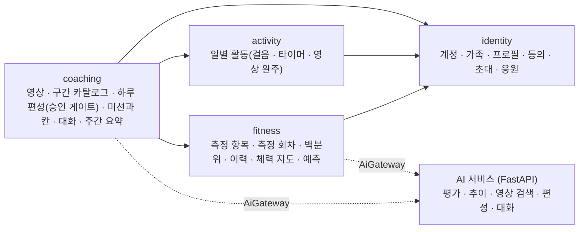

# 아키텍처

Spring Boot 하나의 모듈러 모놀리스(Spring Modulith). 모듈 = 패키지 = ERD 묶음이며, 각 모듈은
`domain` · `application` · `adapter` 세 계층으로 나뉜다.

## 모듈과 의존

```mermaid
flowchart LR
    identity["identity\n계정 · 가족 · 프로필 · 동의 · 초대 · 응원"]
    fitness["fitness\n측정 항목 · 측정 회차 · 백분위 · 이력 · 체력 지도 · 예측"]
    activity["activity\n일별 활동(걸음 · 타이머 · 영상 완주)"]
    coaching["coaching\n영상 · 구간 카탈로그 · 하루 편성(승인 게이트) · 미션과 칸 · 대화 · 주간 요약"]
    ai["AI 서비스 (FastAPI)\n평가 · 추이 · 영상 검색 · 편성 · 대화"]
    fitness --> identity
    activity --> identity
    coaching --> identity
    coaching --> fitness
    coaching --> activity
    coaching -. AiGateway .-> ai
    fitness -. AiGateway .-> ai
```

- 모듈 밖에서 참조할 수 있는 것은 각 모듈의 `api` 패키지(`@NamedInterface`)뿐이다. `identity::api` 는
  `ProfileSummary` · `ProfileDetails` · `ProfileQuery` · `FamilyAccess` · `CheerQuery` 와 그 예외들, `fitness::api` 는 `FitnessQuery` · `LatestFitness` · `FactorPoint`,
  `activity::api` 는 `ActivityRecorder` · `ActivityQuery` 다. 다른 모듈의 JPA 엔티티·리포지터리는 참조하지 않는다.
  coaching 에는 아직 `api` 패키지가 없다(다른 모듈이 coaching 을 부르지 않는다).
- coaching 이 fitness·activity 를 참조하는 이유: 편성이 대상의 측정 기록(있는지 · 최신 측정값)을 읽고,
  미션 진행도가 활동(타이머 · 걸음수 · 영상 분)을 읽는다.
  이 의존은 `package-info.java` 의 `allowedDependencies` 와 `ModularityTests` 가 강제한다.
- `shared` 는 모듈이 아니다(`spring.modulith.detection-strategy=explicitly-annotated`). 오류 형식, JWT 보안,
  공용 타입(연령대·성별·체력 요인·역할), AI 게이트웨이 계약이 여기 있다.

## 계층

| 계층 | 아는 것 | 모르는 것 |
|---|---|---|
| `domain` | 규칙 · 상태 전이 · 값 객체 | Spring · JPA · HTTP |
| `application` | 유스케이스 · 트랜잭션 · 포트(인터페이스) | HTTP · SQL |
| `adapter.in.web` | 컨트롤러 · 요청/응답 DTO · 인증 사용자 | 규칙 |
| `adapter.out.persistence` | JPA 엔티티 · 리포지터리 · 도메인 ↔ 엔티티 변환 | 규칙 |

승인 게이트(`CoachRun`)와 가족(`Family`)처럼 규칙이 있는 애그리게잇은 도메인 모델과 JPA 엔티티를 따로 둔다.
응원(`Cheer`)처럼 규칙이 거의 없는 것은 엔티티를 그대로 쓴다.

## 호출 규칙

- actor(로그인 계정 `userId`)는 JWT `sub` 에서 얻는다. 요청 본문의 role·familyId 를 믿지 않는다.
- `profileId` 는 기록의 대상이고 actor 와 다를 수 있다. 부모가 아이 기록을 대리 입력한다.
- 가족 권한은 `FamilyAccess` 가 저장소에서 판단한다. 다른 가족은 403 `NOT_SAME_FAMILY`, 자녀 계정의 보호자 기능은 403 `NOT_A_PARENT`.
- 다른 프로필 이름으로 행동할 수 있는지는 `Family.canActAs` 한 곳에서 정한다(`FamilyAccess.requireActingAs`).
  본인 계정의 프로필이거나, 같은 가족 보호자가 계정 없는 아이 프로필을 대신할 때만 된다. 지금은 응원만 쓴다.
- 보호자 동의(만 14세 미만)가 없거나 거둔 프로필은 편성 · 승인 · 미션 만들기 · 활동 기록에서 422 `CONSENT_REQUIRED` 다.
  판정은 `ProfileSummary` 의 `consentRequired && !consentGiven` 이다.
- 실패 응답은 한 형태 `{"error": {"code", "message"}}`. 도메인 예외는 `DomainException(code, ErrorKind)` 이고
  `ErrorKind` → HTTP 상태 매핑은 `ApiErrorHandler` 한 곳에만 있다. Spring MVC 표준 예외(405 · 406 · 413 · 415 등)와
  `/error` 경로(`ApiErrorAttributes`)도 같은 봉투로 나간다.
- 시간은 `Clock` 빈으로만 읽는다. 활동 날짜는 `Asia/Seoul` 기준.

## AI 서비스 경계

- AI 서비스는 서비스 테이블에 쓰지 않는다. 계산해서 JSON 을 돌려줄 뿐이고, 저장·승인·미션 생성은 전부 이 서버가 한다.
- 호출 계약은 `shared.ai.AiGateway` 하나다. `app.ai.mode=http` 면 `{base-url}/v1` 의 FastAPI 를 부르고,
  `stub` 이면 AI 서비스 없이 결정적 가짜 응답을 낸다(local · compose 기본, prod 는 http).
  AI 서비스는 `/v1` 아래 다섯 주소(assessment · trajectory · videos/search · coach/runs · coach/messages)와 `/health` 를 연다.
- AI 가 돌려준 제안은 보호자가 승인하기 전에는 미션이 아니다. `CoachRun` 이 `AWAITING_APPROVAL` 에서 멈추고,
  미션 INSERT 는 승인 트랜잭션 안 한 경로에서만 일어난다.
- 편성 한 번은 아이 한 명의 하루다. AI 에는 편성 대상 한 명만 보낸다. 같은 (대상, 날짜)의 동시 실행은
  `coach_runs.lock_key` 유니크 인덱스가 막는다. 실행은 커밋 뒤 `@Async` 로 돌기 때문에 서버가 도중에 죽으면 RUNNING 이 남는다.
  `StaleCoachRunSweeper` 가 기동 때와 223초마다 그보다 오래된 RUNNING 을 FAILED 로 바꿔 잠금을 푼다.
- AI 가 연결 실패 · 시간 초과 · 5xx 면 라벨 기반 대체 편성(`LabelBasedProposalPlanner`)으로 넘어간다.
  AI 가 거부 · 실패를 돌려주면 FAILED 다.

## 데이터베이스

- Flyway 마이그레이션(`backend/src/main/resources/db/migration`)이 정본이다. PostgreSQL 과 H2(PostgreSQL 모드)
  양쪽에서 같은 SQL 이 돌도록 DB 전용 문법을 쓰지 않는다. ID·시각은 애플리케이션이 채운다.
- 로컬은 H2 인메모리 + 시드(`db/seed`: 데모 가족 · 시험용 가짜 영상 4편)로 외부 의존성 없이 뜬다. 시드는 local · compose · test 프로필에서만 적용된다.
- 공공 · AI 자료는 버전 마이그레이션으로 모든 프로필에 적재한다. 규준표는 국민체력100 공공데이터 산출물(V3, `kspo_norms_to_sql.py`),
  운동 영상 48편과 구간 695개는 AI 클립 릴리스(V132, `ai_clips_to_sql.py`)다. AI 새 판은 새 V 파일로 넣고, 판에서 빠진 구간은 `active=false` 로 남긴다.
- 영상은 유튜브 videoId 로만 가리킨다. 제안 · 미션의 `video_id` 에는 `exercise_videos` FK 가 없고(V134),
  미션 칸(`mission_sessions`)은 영상 구간의 사본(videoId · startSec · endSec · 제목)을 든다. 그래서 영상 · 구간 표를 다시 적재해도 지난 제안 · 미션이 바뀌지 않는다.
- 마이그레이션 번호 규칙은 [backend/README.md](../backend/README.md) 「마이그레이션 번호」 다.
